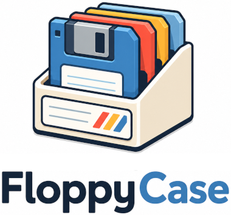

# FloppyCase

<p align="center">
  
</p>

> **Public beta.** FloppyCase works for day-to-day play, but APIs, paths, and
> UX may still change. Please file issues when something breaks.

**Plug-and-play Amiga gaming on Linux.**

Getting classic Amiga games to work on Linux can be a complicated and
techincally advanced process involving installing and configuring several libraries. With
`FloppyCase` the hard work is already done. Just install the app, add your games
and purchased Amiga ROMs, and start playing.

FloppyCase automatically fetches the [WHDLoad](https://whdload.de/) helper and the [Amiberry](https://amiberry.com/) Amiga emulator for you and configures them.

> Goal: go from *nothing* to *playing an Amiga game* with as little friction as
> possible.

## Requirements

- Linux desktop (developed and tested on **Mint/Debian**)
- **Python 3.10+**
- `git` — needed for `pipx install` from GitHub
- `pipx` — system `pip install` is blocked on modern Debian/Ubuntu/Mint
  (`externally-managed-environment`)
- `python3-tk` for the GUI
- Network access the first time you run `floppycase install`

## What it does

- **One-command setup** – installs the emulator backend, WHDLoad support, the
  `~/FloppyCase` folder layout, and a desktop launcher.
- **Tidy directory layout** – a single `~/FloppyCase` folder with `games/`,
  `workbench/`, `configs/`, `whdload/` and `downloads/`. Kickstart ROMs live in
  the emulator's ROM folder (one place only).
- **Automatic configuration** – detects your Kickstart ROM by CRC32 and picks
  the matching model (**A500** or **A1200**) with the correct chipset/CPU and
  the **maximum recommended Fast RAM** (8 MB). If no ROM is present it falls
  back to the built-in **AROS** Kickstart replacement, so you can boot an Amiga
  with zero copyrighted files.
- **Real click-to-play** – WHDLoad games (`.lha`) boot straight into the game;
  ADF disk images boot the floppy directly.
- **Optional start-menu launchers** – tick **Add to start menu** on a game in
  the GUI (or pass `--launcher` on `add-game` / `scan`) to add a freedesktop
  `.desktop` entry so you can launch favorites from your Linux application menu
  without opening the FloppyCase window. Off by default.
- **Friendly desktop app** – `floppycase gui` opens a scrollable alphabetical list
  of your games; click the play icon (or double-click a row) to launch.
- **Per-game settings & notes** – a cog on each row opens a dialog to set
  controls, window scale, fullscreen and a display filter, plus a free-text
  **notes** field to remember what you worked out for a game. A global
  **Settings** dialog sets the defaults for everything.
- **Playable on a keyboard** – games launch with keyboard-as-joystick by
  default (cursor keys + Space to fire); switch to numpad or a gamepad per game
  or globally.

## Install FloppyCase and dependencies

```bash
# One-time system packages
sudo apt install git pipx python3-tk python3-venv
pipx ensurepath
# reopen the terminal if pipx ensurepath tells you to

# Install FloppyCase itself (goes on your PATH via pipx)
# Package name is included so older pipx versions can resolve the git URL.
pipx install 'floppycase @ git+https://github.com/pblasone/floppycase.git'

# Create ~/FloppyCase and install the emulator + support files
floppycase install
```

That single `floppycase install` creates the `~/FloppyCase` directories, installs
dependencies, and adds FloppyCase to your application menu. You do **not** need
a separate `init` step.

To upgrade later:

```bash
pipx upgrade floppycase
# or, to reinstall from GitHub:
pipx install --force 'floppycase @ git+https://github.com/pblasone/floppycase.git'
```

## Add some games

FloppyCase plays **WHDLoad** game packs (usually `.lha` files) and classic
**ADF** floppy images.

1. Download WHDLoad games (lots of them are listed on
   [Games Nostalgia](https://gamesnostalgia.com/whdownload)).
2. Copy the `.lha` files (or unpacked game folders) into
   `~/FloppyCase/games`.
3. Open FloppyCase — it scans that folder and lists what it finds.

Prefer RetroPlay-style `.lha` packs with one top-level game folder containing a
`.slave` file. You can also register games from the terminal with
`floppycase scan` or `floppycase add-game`.

## Add Amiga ROMs

Without original Kickstart ROMs, FloppyCase falls back to the built-in **AROS**
ROM. That is enough to start a basic Workbench-like environment, but **most
commercial games will not run correctly** until real Kickstarts are installed.

Kickstart ROMs are stored in **one place**: the emulator's ROM folder (usually
`~/Amiberry/ROMs/`). FloppyCase does not keep a second copy under
`~/FloppyCase`.

The legal way to obtain Kickstart ROMs is
[Amiga Forever](https://www.amigaforever.com/) from Cloanto.

1. Install Amiga Forever and locate its ROMs folder (it contains the Kickstart
   files and usually a `rom.key`).
2. Copy **everything** from that folder — including `rom.key` — into the ROM
   folder shown by `floppycase doctor` / `floppycase install` (typically
   `~/Amiberry/ROMs/`).
3. Run `floppycase sync-roms` (or simply launch a game); FloppyCase decodes
   Cloanto-encoded ROMs automatically when `rom.key` is present.

`floppycase doctor` prints the exact ROM folder in use and warns about encrypted
ROMs that still need a key.

## Start gaming

- From your desktop: open **FloppyCase** in the application menu / launcher.
- From a terminal: `floppycase gui`

Click the play icon (or double-click a row) to launch a game. Use the cog on a
row for per-game controls, display options, and notes.

### Host keys while a game is running

Amiberry grabs the keyboard/mouse while its window has focus (so volume keys and
other desktop shortcuts usually will not work until you release it):

| Keys | Action |
| --- | --- |
| **Ctrl+Alt** (either side; AltGr+Ctrl also works) | Release the mouse back to Linux |
| **F10** | Quit the emulator (also leaves WHDLoad games without stopping at Workbench) |
| **F11** | Toggle fullscreen |
| **F12** | Open the Amiberry GUI |

After **Ctrl+Alt**, you can change volume, switch windows, etc., then click the
Amiga window again to continue.

### Prefer the terminal?

```bash
# Boot an Amiga right now with the free AROS ROM (no Kickstart needed)
floppycase config --model a500
floppycase run a500

# Or drop a Kickstart ROM into the emulator ROM folder first, then:
floppycase config          # auto-detects the ROM and picks the model

# Scan the games folder and register everything found
floppycase scan

# Add a single game (use --launcher to add it to your app menu)
floppycase add-game ~/Downloads/TurricanII --model a500 --name "Turrican II" --launcher
```

## Commands

| Command | What it does |
| --- | --- |
| `floppycase gui` | Open the desktop app: scan the games folder and click to play. |
| `floppycase install` | Install dependencies, create `~/FloppyCase`, add the app menu entry. |
| `floppycase init` | Create the `~/FloppyCase` directory structure only (also done by `install`). |
| `floppycase config` | Generate a machine config (auto-detects ROM/model). |
| `floppycase scan` | Scan the games folder and register every game found. |
| `floppycase add-game <path>` | Store a game and build its config (`--launcher` adds an app-menu entry). |
| `floppycase run <name>` | Boot the game (WHDLoad auto-boot for `.lha`, floppy for ADF). |
| `floppycase sync-roms` | Decode (if needed) and refresh Kickstart ROMs. |
| `floppycase clean-configs [name]` | Reset cached WHDLoad game config(s). |
| `floppycase list` | List detected ROMs and generated configs. |
| `floppycase doctor` | Report what is installed / configured / missing. |

The model for new games is auto-detected from your ROM (a KS 3.1 A1200 ROM →
A1200); pass `--model` to override.

Use `--base <dir>` (or the `FLOPPYCASE_HOME` env var) to manage a setup somewhere
other than `~/FloppyCase`.

## Tuning games (controls, display, notes)

Click the cog on a game row (or set global defaults from the toolbar
**Settings** button) to adjust:

- **Controls** – keyboard layouts matching Amiberry (arrows + Space, arrows +
  Left Ctrl, WASD, numpad, or gamepad). CD32 pad mode can be forced on/off when
  auto-detection is wrong.
- **Display** – fullscreen, window scale, CRT filter, horizontal/vertical
  centering (`none` / `simple` / `smart`), and pixel offsets when the picture
  looks misaligned in the viewport.
- **Input** – block duplicate keypresses (Amiberry's keyboard-as-joystick option).
- **Notes** – free text saved per game.

WHDLoad games pick CPU, chipset and RAM from the WHDLoad database at boot; you do
not need to choose A500 vs A1200 manually. Scan/add still writes a local config
for metadata, using the best Kickstart ROM you have installed.

These are stored in `~/FloppyCase/library.json` and applied at launch as Amiberry
``-s key=value`` options. A game's settings override the global defaults; leave
a field on `default` to inherit or let the WHDLoad booter decide.

## How model auto-configuration works

`floppycase` mirrors Amiberry's own behaviour: it hashes every file in `roms/`
with CRC32 and matches it against a database of well-known Kickstart images to
pick the best model.

| Model | Chipset | CPU | Chip RAM | Fast RAM |
| --- | --- | --- | --- | --- |
| Amiga 500 | OCS | 68000 | 512 KB | 8 MB |
| Amiga 1200 | AGA | 68020 | 2 MB | 8 MB |

If no ROM is found, the built-in **AROS** ROM is used automatically.

## ROMs, WHDLoad and the law

Original **Kickstart ROMs and Workbench are copyrighted** and are *not*
distributed with FloppyCase. The legal way to obtain them is
[Amiga Forever](https://www.amigaforever.com/) from Cloanto.

Put ROMs in the emulator ROM folder (typically **`~/Amiberry/ROMs/`**, including
`rom.key` when Amiga Forever ships encoded files). That is the single source of
truth — `floppycase doctor` prints the folder currently in use.

For a fully free setup, FloppyCase uses the open-source
[AROS](https://aros.org/) Kickstart replacement.

### Amiga Forever (encrypted) ROMs

Amiga Forever often ships ROMs in Cloanto's *encoded* form (an `AMIROMTYPE1`
header, scrambled with `rom.key`). Those files cannot be booted until they are
decoded. If you copy `rom.key` into the ROM folder alongside the ROMs,
FloppyCase decodes them automatically. If you don't have a `rom.key`, run Amiga
Forever once (newer versions decrypt the ROMs on first launch) and copy the
resulting `.rom` files instead. `floppycase doctor` flags encrypted ROMs and
tells you exactly what to do.

If a game got a bad auto-config before your ROMs were set up, reset it with
`floppycase clean-configs <name>` — or launch it again so the cached WHDLoad
config regenerates against your current ROMs.

### How games are launched

- **WHDLoad `.lha` games** auto-boot into the game (no manual Workbench setup).
  This works best with a **Kickstart 3.1 (A1200)** ROM available (and ideally
  1.3 as well). Prefer RetroPlay `.lha` packs with one top-level folder
  containing the `.slave`.
- **ADF disk images** boot the floppy directly using a generated config with
  the auto-detected model and your Kickstart.

Run `floppycase doctor` if something will not start.

## Known limitations

- **Linux only** for now (desktop integration targets freedesktop / apt).
- WHDLoad auto-boot works best with a **Kickstart 3.1 (A1200)** ROM installed;
  without it, many `.lha` packs will not start cleanly.
- Game compatibility ultimately depends on the emulator / WHDLoad, not FloppyCase.
- This is a **beta**: expect rough edges, and please report them.

## Troubleshooting

Start with:

```bash
floppycase doctor
```

It reports whether the emulator backend, WHDLoad support, Kickstart ROMs, and
the directory layout look healthy, and prints the ROM folder FloppyCase is using.

Common fixes:

- Game screen cropped at the top / shifted sideways → set **Amiga screen** to **640x512** (the default) or try **720x568** in Settings; use Center/Offset only for fine-tuning. Offsets need a FloppyCase upgrade that maps them to Amiberry's `gfx_*_offset` options.
- `pipx` cannot determine package name → use
  `pipx install 'floppycase @ git+https://github.com/pblasone/floppycase.git'`
  (and ensure `git` is installed: `sudo apt install git`)
- GUI missing / Tk errors → `sudo apt install python3-tk`, then
  `pipx install --force 'floppycase @ git+https://github.com/pblasone/floppycase.git'`
  and re-run `floppycase install`
- Generic cog icon in the Mint/Ubuntu menu → upgrade, then
  `floppycase install` again (refreshes PNG icons + the `.desktop` file). Log
  out and back in if the menu still caches the old icon.
- Encrypted Amiga Forever ROMs → copy `rom.key` into the ROM folder from
  `floppycase doctor`, then `floppycase sync-roms`
- Stale WHDLoad boot settings → `floppycase clean-configs <game>`
- Wrong data directory → set `FLOPPYCASE_HOME` or pass `--base`

## Disclaimer

FloppyCase is provided **as is**, without warranty of any kind. You are
responsible for ensuring you have the legal right to use any Kickstart ROMs,
Workbench files, and game images you add. FloppyCase does **not** distribute
copyrighted Amiga system software or commercial games.

FloppyCase uses third-party components (notably Amiberry and WHDLoad) with their
own licenses and terms. "Amiga" is a trademark of its respective owner;
FloppyCase is an independent project and is not affiliated with or endorsed by
the trademark holder.

## Support

- File bugs and feature requests in
  [GitHub Issues](https://github.com/pblasone/floppycase/issues).
- Include `floppycase doctor` output (and your distro / Python version) when
  reporting install or launch problems.
- Security reports: see [SECURITY.md](SECURITY.md).
- Contributions: see [CONTRIBUTING.md](CONTRIBUTING.md).

## Development

```bash
git clone https://github.com/pblasone/floppycase.git
cd floppycase
python3 -m venv .venv
.venv/bin/pip install -e '.[dev]'
.venv/bin/pytest
```

## Acknowledgments

FloppyCase was built with substantial help from
[Cursor](https://cursor.com/) and the **Grok 4.5** model. AI tools accelerated
implementation and documentation; the project is maintained by humans who remain
responsible for its design, review, and releases.

## License

[GPL-3.0-or-later](LICENSE). Third-party components such as Amiberry and WHDLoad
are the property of their respective authors and are installed from their
official distributions.
